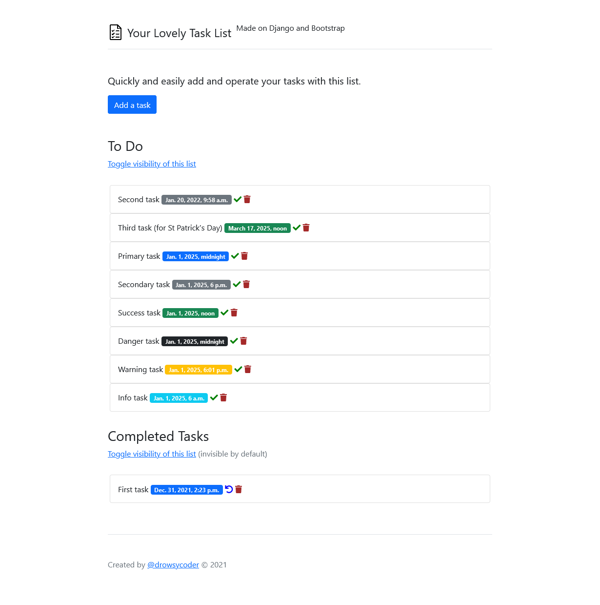

# Task List


[](https://codeclimate.com/github/drowsycoder/dcc-basic-todo/maintainability)

A single-page basic to-do list (as a technologies testing).

### Technologies

- Python v3.9.6
- Django v3.2.6
- Bootstrap v5.1.0
- HTML5, CSS3

### Instructions

Clone the project:
```
git clone https://github.com/drowsycoder/dcc-basic-todo.git
```

Apply all database migrations:
```
python manage.py migrate
```

Create a superuser:
```
python manage.py createsuperuser
```

Collect static files:
```
python manage.py collectstatic --no-input
```

Run a test server:
```
python manage.py runserver
```

Project settings are located in ```/todo/``` folder.

### Author

[@drowsycoder](https://github.com/drowsycoder/)

### Screenshot

